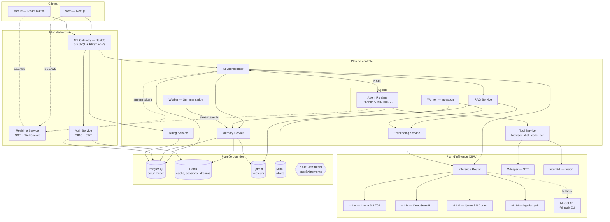
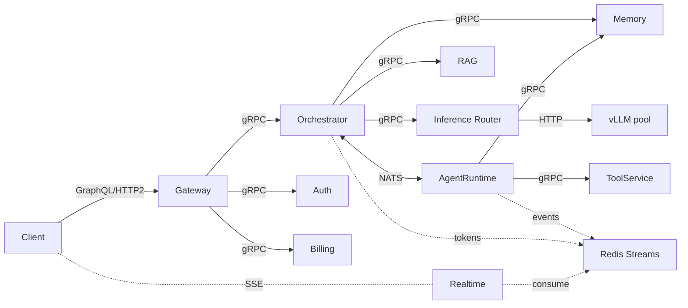
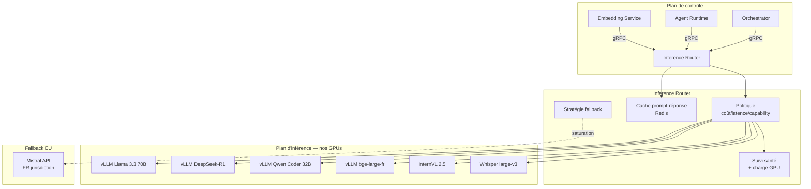
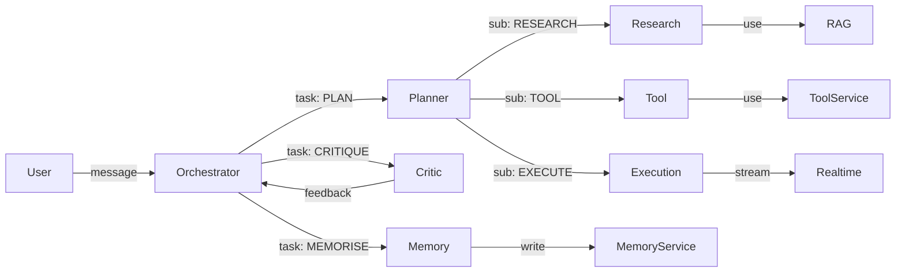
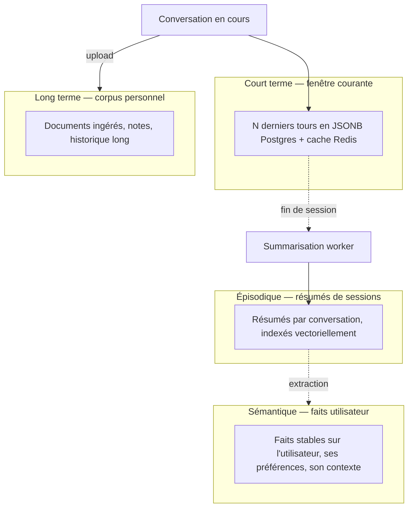
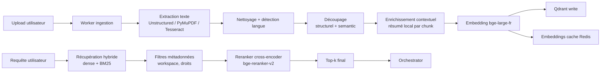
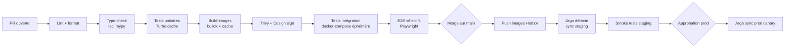

# Architecture de Référence — Plateforme IA Souveraine

> **Statut** : document d'onboarding (étoile-polaire), pas une spécification d'implémentation
> **Public** : équipe d'ingénierie rejoignant la plateforme
> **Périmètre** : architecture cible à 18 mois — pas le code du Jour-1
> **Souveraineté** : auto-hébergé, hors cloud américain, EU-pragmatique (hybride)
> **Langue** : français

---

## Sommaire

- [Partie 0 — Préambule](#partie-0--préambule)
- [Partie I — Vision & contraintes](#partie-i--vision--contraintes)
- [Partie II — Architecture haute-niveau](#partie-ii--architecture-haute-niveau)
- [Partie III — Décomposition en services](#partie-iii--décomposition-en-services)
- [Partie IV — Monorepo & structure de code](#partie-iv--monorepo--structure-de-code)
- [Partie V — Communication inter-services](#partie-v--communication-inter-services)
- [Partie VI — Schémas de données](#partie-vi--schémas-de-données)
- [Partie VII — Routeur d'inférence](#partie-vii--routeur-dinférence)
- [Partie VIII — Orchestration d'agents](#partie-viii--orchestration-dagents)
- [Partie IX — Architecture mémoire](#partie-ix--architecture-mémoire)
- [Partie X — Pipeline RAG](#partie-x--pipeline-rag)
- [Partie XI — Streaming temps réel](#partie-xi--streaming-temps-réel)
- [Partie XII — Topologie infrastructure](#partie-xii--topologie-infrastructure)
- [Partie XIII — Déploiement](#partie-xiii--déploiement)
- [Partie XIV — CI/CD](#partie-xiv--cicd)
- [Partie XV — Observabilité](#partie-xv--observabilité)
- [Partie XVI — Sécurité & souveraineté](#partie-xvi--sécurité--souveraineté)
- [Partie XVII — Mise à l'échelle](#partie-xvii--mise-à-léchelle)
- [Partie XVIII — Coûts & économie](#partie-xviii--coûts--économie)
- [Annexes](#annexes)

---

## Partie 0 — Préambule

### 0.1 À qui s'adresse ce document

À toi qui rejoins l'équipe. Il te donne le **plan d'ensemble** : ce qu'on construit, pourquoi ces choix, et comment les morceaux s'imbriquent. Il n'est ni un tutoriel, ni une référence d'API. Pour ces derniers, voir respectivement `docs/onboarding/` et les schémas GraphQL/OpenAPI exposés par chaque service.

### 0.2 Ce que ce document n'est pas

- **Pas une spec d'implémentation.** Chaque service a (ou aura) sa propre spec dans `docs/specs/`.
- **Pas une description du Jour-1.** L'architecture présentée est la cible à 18 mois. La Partie III précise ce qui est _réellement déployé_ aujourd'hui.
- **Pas figé.** Les décisions structurantes sont consignées en `docs/adr/` ; quand une décision change, on amende l'ADR et on met ce document à jour.

### 0.3 Les cinq décisions qui contraignent tout

Si tu ne dois retenir que cinq choses :

1. **On ne pré-entraîne aucun modèle de fondation.** L'avantage compétitif est l'orchestration, la mémoire, le RAG, l'UX et la souveraineté — pas la taille des poids.
2. **Souveraineté EU-hybride.** GPUs en colocation ou loués chez un opérateur EU (Scaleway, OVHcloud). Tout le reste tourne sur Kubernetes hébergé EU. Aucune dépendance d'exécution sur un cloud US (Claude API, OpenAI API, AWS, GCP, Azure exclus du chemin de requête).
3. **Modèles à poids ouverts.** DeepSeek-R1, Llama 3.x, Qwen, Mistral (poids ouverts ou via Mistral API hébergée en France), Gemma. Servis via vLLM sur nos GPUs.
4. **Monorepo Turborepo + pnpm workspaces.** Un seul dépôt pour tout : apps, services, packages partagés, IaC.
5. **15 services logiques, 6 binaires déployés au Jour-1.** Voir Partie III. La décomposition logique ne dicte pas la décomposition de déploiement.

### 0.4 Glossaire express

| Terme                   | Définition                                                                                                                                                                                                        |
| ----------------------- | ----------------------------------------------------------------------------------------------------------------------------------------------------------------------------------------------------------------- |
| **Orchestrateur**       | Service qui reçoit une requête utilisateur, décide quels agents/outils invoquer, compose le prompt final, choisit le modèle via le routeur, et stream la réponse.                                                 |
| **Routeur d'inférence** | Composant qui décide _quel_ modèle servir une requête donnée (coût, latence, capacité requise) et qui parle au runtime vLLM correspondant.                                                                        |
| **Agent**               | Boucle raisonnement-action avec un rôle spécialisé (Planner, Critic, Tool, …). Tourne dans l'agent-runtime, communique via NATS.                                                                                  |
| **Souvenir**            | Unité indexable de mémoire long-terme. Quatre couches : court terme (fenêtre conversation), épisodique (résumés de sessions), sémantique (faits stables sur l'utilisateur), long terme (corpus personnel ingéré). |
| **Pièce de contexte**   | Tout fragment qu'on injecte dans un prompt : message, document RAG, souvenir, sortie d'outil.                                                                                                                     |
| **Plan de contrôle**    | Cluster K8s qui exécute le code applicatif (API, workers, orchestrateur).                                                                                                                                         |
| **Plan d'inférence**    | Cluster K8s qui exécute les serveurs de modèles (vLLM) sur GPUs. Séparé pour des raisons de coût, de scaling et de profil matériel.                                                                               |

---

## Partie I — Vision & contraintes

### 1.1 Mission

Construire un assistant IA qui _paraisse intelligent_ sur la durée — qui se souvienne, qui raisonne, qui utilise des outils, qui collabore avec lui-même via des agents, et qui s'adapte à chaque utilisateur. Le tout sur infrastructure souveraine européenne.

### 1.2 Différenciation

On ne joue pas la course aux paramètres. On joue :

- **Orchestration** : raisonnement multi-agent fiable et observable.
- **Mémoire** : continuité réelle entre sessions, pas un simple historique.
- **Récupération** : RAG hybride avec reranking et récupération contextuelle.
- **UX** : streaming dense, visualisation du raisonnement et des outils, basse latence.
- **Souveraineté** : argument commercial et réglementaire (RGPD, AI Act, secteurs régulés).

### 1.3 Cibles d'échelle

- **MVP (mois 0-6)** : 1 000 utilisateurs actifs hebdo, ~10 GPU H100.
- **Croissance (mois 6-18)** : 100 000 utilisateurs actifs, ~80 GPU.
- **Cible long-terme** : 1 M+ utilisateurs, multi-cluster GPU, multi-région EU.

L'architecture est dimensionnée pour absorber la croissance par scaling horizontal sans réécriture majeure.

---

## Partie II — Architecture haute-niveau

### 2.1 Vue d'ensemble



### 2.2 Flux d'une requête utilisateur (de bout en bout)

Cas : utilisateur authentifié envoie « Analyse le PDF que je viens d'uploader et propose un plan d'action ».

1. **Client → Gateway** : mutation GraphQL `sendMessage` (HTTP/2). Le client ouvre simultanément un canal SSE auprès du `realtime-service` avec l'ID de conversation.
2. **Gateway → Auth** : vérification du JWT (introspection cachée en Redis).
3. **Gateway → Orchestrator** : appel gRPC, transmet le message, l'ID utilisateur, l'ID conversation.
4. **Orchestrator → Memory** : récupère court-terme (N derniers tours) + sémantique pertinente (profil utilisateur, préférences).
5. **Orchestrator → RAG** : pour le PDF référencé, récupère les chunks pertinents (déjà ingérés par `worker-ingestion` à l'upload).
6. **Orchestrator → Router** : « j'ai besoin d'un modèle de raisonnement, contexte 32k, latence non critique ». Le routeur sélectionne DeepSeek-R1, envoie la requête à l'instance vLLM la moins chargée.
7. **Orchestrator** : si le raisonnement décide qu'un _plan d'action_ doit être généré par un agent dédié, publication sur NATS d'une tâche pour `PlannerAgent` dans l'agent-runtime.
8. **Agent runtime** : `PlannerAgent` exécute sa boucle, peut invoquer `ToolAgent` (lecture du PDF en haute fidélité via le `tool-service`), puis `CriticAgent` valide.
9. **Streaming** : tokens et évènements (`agent_started`, `tool_called`, `tool_result`, `agent_finished`) sont publiés sur Redis Streams, consommés par `realtime-service`, retransmis au client via SSE.
10. **Memory** : `worker-summarisation` consomme l'évènement de fin de conversation et écrit un résumé épisodique.

### 2.3 Frontières & responsabilités

| Plan          | Responsabilité                                                                                       | Cycle de release        |
| ------------- | ---------------------------------------------------------------------------------------------------- | ----------------------- |
| **Bordure**   | Authentifier, router, ouvrir les canaux temps-réel. Aucune logique métier.                           | Hebdomadaire            |
| **Contrôle**  | Logique applicative, agents, orchestration, RAG, mémoire. C'est ici qu'on passe 80 % de notre temps. | Plusieurs fois par jour |
| **Inférence** | Servir des modèles. Stateless. Pinné en version.                                                     | Mensuel (sauf urgence)  |
| **Données**   | Stocker. Aucune logique.                                                                             | Migrations contrôlées   |

Cette séparation est **stricte** : un service de contrôle ne parle jamais directement à vLLM, il passe par le routeur.

---

## Partie III — Décomposition en services

### 3.1 Les 15 services logiques

| #   | Service                | Rôle                              | Stack                |
| --- | ---------------------- | --------------------------------- | -------------------- |
| 1   | `web`                  | App utilisateur web               | Next.js 15, Apollo   |
| 2   | `mobile`               | App mobile                        | React Native + Expo  |
| 3   | `api-gateway`          | Façade GraphQL/REST/WS            | NestJS               |
| 4   | `auth-service`         | OIDC, sessions, RBAC              | NestJS               |
| 5   | `billing-service`      | Quotas, plans, facturation        | NestJS               |
| 6   | `ai-orchestrator`      | Boucle de raisonnement principale | Python + FastAPI     |
| 7   | `agent-runtime`        | Hôte d'exécution des agents       | Python               |
| 8   | `tool-service`         | Exécution sandboxée d'outils      | Python + Firecracker |
| 9   | `memory-service`       | API mémoire 4 couches             | Python               |
| 10  | `rag-service`          | Requêtes RAG (retrieve + rerank)  | Python               |
| 11  | `embedding-service`    | API d'embeddings                  | Python               |
| 12  | `inference-router`     | Routage modèles                   | Python ou Go         |
| 13  | `realtime-service`     | Diffusion SSE/WS                  | Node.js (Fastify)    |
| 14  | `worker-ingestion`     | Pipelines ingestion documents     | Python (Celery/Arq)  |
| 15  | `worker-summarisation` | Résumés mémoire async             | Python               |

### 3.2 Stratégie de déploiement Jour-1 vs Jour-N

Quinze déploiements pour une petite équipe = bruit ops. On regroupe.

**Jour-1 — 6 binaires déployés** :

```
┌──────────────────────┐
│ edge-api             │  ← api-gateway + auth-service + billing-service
└──────────────────────┘
┌──────────────────────┐
│ ai-core              │  ← ai-orchestrator + agent-runtime + memory-service
└──────────────────────┘
┌──────────────────────┐
│ retrieval            │  ← rag-service + embedding-service
└──────────────────────┘
┌──────────────────────┐
│ tools                │  ← tool-service (isolé pour sandboxing)
└──────────────────────┘
┌──────────────────────┐
│ realtime             │  ← realtime-service (isolé pour profil de charge)
└──────────────────────┘
┌──────────────────────┐
│ workers              │  ← worker-ingestion + worker-summarisation
└──────────────────────┘
```

Plus, sur le plan d'inférence : `inference-router` + N instances vLLM.

**Critères d'extraction** d'un module en service séparé :

- Profil de charge divergent (CPU vs IO vs GPU).
- Frontière de sécurité (le tool-service est extrait dès le Jour-1 pour cette raison).
- Équipe dédiée prête à le posséder.
- SLO différent (le realtime-service a des exigences de latence propres).

Tant qu'aucun critère n'est rempli, on garde le module dans son binaire d'origine. Un module = un dossier `apps/<nom>/` ; un binaire = un Dockerfile qui en assemble plusieurs.

---

## Partie IV — Monorepo & structure de code

### 4.1 Outils

- **Turborepo** pour le cache de build et l'orchestration de tâches.
- **pnpm workspaces** pour les dépendances JavaScript/TypeScript.
- **uv** (Astral) pour les dépendances Python (rapide, lockfile reproductible, gère plusieurs versions Python).
- **Nx** non retenu : Turborepo suffit, moins opinionant.

### 4.2 Arborescence

```
ClaudeMaison/
├── apps/
│   ├── web/                      # Next.js
│   ├── mobile/                   # React Native + Expo
│   ├── api-gateway/              # NestJS
│   ├── auth-service/             # NestJS
│   ├── billing-service/          # NestJS
│   ├── realtime-service/         # Fastify + ws
│   ├── ai-orchestrator/          # Python + FastAPI
│   ├── agent-runtime/            # Python
│   ├── tool-service/             # Python + Firecracker host
│   ├── memory-service/           # Python
│   ├── rag-service/              # Python
│   ├── embedding-service/        # Python
│   ├── inference-router/         # Python (Go envisagé si besoin)
│   ├── worker-ingestion/         # Python (Arq)
│   └── worker-summarisation/     # Python (Arq)
├── packages/
│   ├── shared-types/             # Types GraphQL/Proto générés + DTO
│   ├── shared-ai/                # Helpers LLM, tokenizers, comptage
│   ├── shared-prompts/           # Templates de prompts versionnés
│   ├── shared-agents/            # Définitions d'agents partagées
│   ├── shared-tools/             # Définitions de tools partagées
│   ├── sdk/                      # SDK client TypeScript public
│   ├── ui/                       # Composants React partagés (Tailwind)
│   └── config/                   # ESLint, Prettier, tsconfig, ruff
├── infrastructure/
│   ├── docker/                   # Dockerfiles, docker-compose dev
│   ├── kubernetes/               # Helm charts
│   ├── terraform/                # OVH/Scaleway providers
│   └── monitoring/               # Dashboards Grafana, règles Prom
├── docs/
│   ├── architecture/             # Ce document et ses extensions
│   ├── adr/                      # Architecture Decision Records
│   ├── specs/                    # Specs par service
│   └── runbooks/                 # Procédures ops
├── scripts/                      # Outils dev (seed, lint, codegen)
├── turbo.json
├── pnpm-workspace.yaml
└── README.md
```

### 4.3 Packages partagés — règles

- **`shared-types`** est généré (jamais édité à la main) à partir des schémas GraphQL et `.proto`.
- **`shared-prompts`** versionne chaque template. Un changement de prompt = bump de version + entrée dans le changelog. Les prompts sont des _artefacts_ avec tests d'évaluation associés.
- **`shared-agents`** et **`shared-tools`** sont des registres. Un agent ou un outil est défini une fois, consommé par plusieurs services.
- **Aucun import croisé entre `apps/`.** Tout partage passe par `packages/`.

---

## Partie V — Communication inter-services

### 5.1 Quel style pour quoi

| Style              | Quand l'utiliser                                                                                                | Quand l'éviter                                    |
| ------------------ | --------------------------------------------------------------------------------------------------------------- | ------------------------------------------------- |
| **GraphQL**        | Surface client (web, mobile). Une seule façade riche.                                                           | Communication interne.                            |
| **REST**           | Endpoints simples côté client (upload de fichiers, webhooks entrants). Intégrations tierces.                    | Tout ce qui est interne.                          |
| **gRPC**           | Communication synchrone interne entre services. Schémas `.proto` versionnés.                                    | Côté client navigateur.                           |
| **SSE**            | Streaming de tokens et d'évènements _du serveur vers le client_. Plus simple que WS, suffit pour le 1-way.      | Tout cas où le client doit aussi pousser du flux. |
| **WebSocket**      | Bidirectionnel temps-réel (mode vocal, collaboration multi-utilisateurs sur un workspace).                      | Streaming simple (préférer SSE).                  |
| **NATS JetStream** | Asynchrone interne : évènements, file de travail entre orchestrator et agent-runtime, fan-out de notifications. | Requête-réponse synchrone (préférer gRPC).        |

### 5.2 Diagramme de communication



### 5.3 Contrats, idempotence, traçage

- **Contrats GraphQL/Proto sont la source de vérité.** Toute modification passe par PR avec revue. Les types client sont générés.
- **Idempotence** : toute mutation client porte un `idempotencyKey` (UUIDv7). Le gateway dédup en Redis sur fenêtre 24 h.
- **Traçage** : chaque requête entrante reçoit un `trace_id` (W3C Trace Context), propagé via headers gRPC et metadata NATS. Spans visibles dans Grafana Tempo.
- **Versionnement** : pas de breaking change sans déprécation préalable (1 release minimum).

---

## Partie VI — Schémas de données

### 6.1 PostgreSQL — cœur métier

Un cluster principal (Patroni + streaming replication, 1 primaire + 2 répliques) + PgBouncer.

**Schémas principaux** :

```sql
-- auth
CREATE TABLE users (
    id UUID PRIMARY KEY DEFAULT gen_random_uuid(),
    email CITEXT UNIQUE NOT NULL,
    password_hash TEXT,
    locale TEXT NOT NULL DEFAULT 'fr-FR',
    created_at TIMESTAMPTZ NOT NULL DEFAULT now(),
    deleted_at TIMESTAMPTZ
);

CREATE TABLE workspaces (
    id UUID PRIMARY KEY,
    name TEXT NOT NULL,
    owner_id UUID NOT NULL REFERENCES users(id),
    plan TEXT NOT NULL DEFAULT 'free'
);

CREATE TABLE workspace_members (
    workspace_id UUID REFERENCES workspaces(id),
    user_id UUID REFERENCES users(id),
    role TEXT NOT NULL CHECK (role IN ('owner','admin','member','guest')),
    PRIMARY KEY (workspace_id, user_id)
);

-- conversations
CREATE TABLE conversations (
    id UUID PRIMARY KEY,
    workspace_id UUID NOT NULL REFERENCES workspaces(id),
    user_id UUID NOT NULL REFERENCES users(id),
    title TEXT,
    created_at TIMESTAMPTZ NOT NULL DEFAULT now(),
    updated_at TIMESTAMPTZ NOT NULL DEFAULT now(),
    archived_at TIMESTAMPTZ
);

CREATE TABLE messages (
    id UUID PRIMARY KEY,
    conversation_id UUID NOT NULL REFERENCES conversations(id),
    role TEXT NOT NULL CHECK (role IN ('user','assistant','tool','system')),
    content JSONB NOT NULL,        -- multimodal : [{type:'text'|'image'|'file', ...}]
    parent_id UUID REFERENCES messages(id),
    model_used TEXT,
    token_in INT,
    token_out INT,
    cost_eur_micro BIGINT,         -- coût en micro-euros
    created_at TIMESTAMPTZ NOT NULL DEFAULT now()
);
CREATE INDEX ON messages (conversation_id, created_at);

-- agents / runs
CREATE TABLE agent_runs (
    id UUID PRIMARY KEY,
    conversation_id UUID REFERENCES conversations(id),
    triggered_by_message_id UUID REFERENCES messages(id),
    agent_type TEXT NOT NULL,
    status TEXT NOT NULL,          -- pending|running|succeeded|failed|cancelled
    plan JSONB,
    started_at TIMESTAMPTZ,
    finished_at TIMESTAMPTZ
);

CREATE TABLE agent_steps (
    id UUID PRIMARY KEY,
    run_id UUID NOT NULL REFERENCES agent_runs(id),
    seq INT NOT NULL,
    kind TEXT NOT NULL,            -- think|tool_call|tool_result|message
    payload JSONB NOT NULL,
    created_at TIMESTAMPTZ NOT NULL DEFAULT now()
);
CREATE INDEX ON agent_steps (run_id, seq);

-- memory (métadonnées seulement, vecteurs dans Qdrant)
CREATE TABLE memories (
    id UUID PRIMARY KEY,
    user_id UUID NOT NULL REFERENCES users(id),
    workspace_id UUID REFERENCES workspaces(id),
    layer TEXT NOT NULL CHECK (layer IN ('short','episodic','semantic','long_term')),
    source TEXT NOT NULL,          -- conversation|document|user_fact|tool_output
    source_id UUID,
    summary TEXT NOT NULL,
    importance REAL NOT NULL DEFAULT 0.5,
    last_used_at TIMESTAMPTZ,
    decay_at TIMESTAMPTZ,
    created_at TIMESTAMPTZ NOT NULL DEFAULT now()
);
CREATE INDEX ON memories (user_id, layer, importance DESC);

-- ingestion
CREATE TABLE documents (
    id UUID PRIMARY KEY,
    workspace_id UUID NOT NULL REFERENCES workspaces(id),
    name TEXT NOT NULL,
    mime_type TEXT NOT NULL,
    storage_key TEXT NOT NULL,     -- chemin MinIO
    size_bytes BIGINT NOT NULL,
    sha256 BYTEA NOT NULL,
    status TEXT NOT NULL,          -- queued|processing|ready|failed
    chunk_count INT,
    created_at TIMESTAMPTZ NOT NULL DEFAULT now()
);

-- billing
CREATE TABLE usage_events (
    id UUID PRIMARY KEY,
    workspace_id UUID NOT NULL,
    user_id UUID NOT NULL,
    kind TEXT NOT NULL,            -- llm_tokens|embeddings|tool_run|storage_gb_day
    quantity NUMERIC NOT NULL,
    unit TEXT NOT NULL,
    cost_eur_micro BIGINT NOT NULL,
    metadata JSONB,
    occurred_at TIMESTAMPTZ NOT NULL DEFAULT now()
);
CREATE INDEX ON usage_events (workspace_id, occurred_at);
```

Migrations : **Atlas** ou **Flyway** (Atlas préféré pour le diff déclaratif).

### 6.2 Redis — éphémère

| Usage                                                                               | TTL typique                |
| ----------------------------------------------------------------------------------- | -------------------------- |
| Sessions / cache JWT introspection                                                  | 1 h                        |
| Cache embeddings (clé = hash texte)                                                 | 7 j                        |
| Cache réponses LLM (sur prompts déterministes)                                      | 24 h                       |
| Rate-limit counters                                                                 | fenêtre glissante          |
| Idempotency keys                                                                    | 24 h                       |
| Redis Streams : `stream:conv:<id>` (tokens) et `stream:run:<id>` (évènements agent) | 1 h après dernier consumer |
| Locks distribués (Redlock) pour migrations / cron                                   | < 1 min                    |

Cluster Redis avec persistance AOF activée pour les streams ; pas critique car les évènements sont _aussi_ écrits en Postgres pour rejouabilité.

### 6.3 Qdrant — vecteurs

Collections séparées par dimension/usage :

| Collection       | Vecteur                      | Métadonnées filtrantes                      |
| ---------------- | ---------------------------- | ------------------------------------------- |
| `mem_semantic`   | bge-large-fr (1024d, cosine) | user_id, workspace_id, importance, decay_at |
| `mem_episodic`   | bge-large-fr (1024d, cosine) | user_id, conversation_id, created_at        |
| `docs_chunks`    | bge-large-fr (1024d, cosine) | workspace_id, document_id, page, lang       |
| `docs_summaries` | bge-large-fr (1024d, cosine) | workspace_id, document_id                   |
| `prompts_eval`   | bge-small-fr (384d)          | prompt_id, version                          |

Sharding par `user_id` pour `mem_*` quand la collection dépasse 10M points (Qdrant supporte le sharding par champ de payload).

### 6.4 MinIO — stockage objet

Buckets :

- `documents` : fichiers utilisateurs originaux (chiffrés au repos, SSE-C avec clés en Vault).
- `derived` : versions extraites/converties (texte brut, images extraites de PDF, miniatures).
- `audio` : enregistrements vocaux (mode voix).
- `model-cache` : poids de modèles open-source (snapshot pinné pour reproductibilité).
- `backups` : dumps Postgres + snapshots Qdrant chiffrés.

Déployé en mode distribué (4 nœuds minimum, erasure coding). Hébergé EU.

### 6.5 Pourquoi pas DynamoDB

DynamoDB est un service AWS managé : exclu par la contrainte de souveraineté. Le besoin sous-jacent (KV bas-latence à forte cardinalité) est couvert par :

- **Postgres** pour 95 % des cas (jusqu'à plusieurs millions de QPS avec PgBouncer + partitionnement).
- **Redis** pour le KV chaud éphémère.
- **ScyllaDB** si un cas d'usage _à fort débit d'écriture et faible latence_ émerge (par ex. journalisation d'agent à 100k évènements/s). Open-source, déployable EU. Pas au Jour-1.

---

## Partie VII — Routeur d'inférence

### 7.1 Le problème

Une plateforme avec 6+ modèles servis (raisonnement, généraliste, code, embeddings, vision, STT) doit décider en _millisecondes_ lequel utiliser pour chaque appel, en équilibrant coût, latence, qualité et capacité disponible. Le faire dans le code applicatif disperse cette logique partout et empêche d'optimiser.

### 7.2 Architecture



### 7.3 Politique de sélection

Chaque requête au routeur porte une **`InferenceIntent`** :

```protobuf
message InferenceIntent {
  Capability capability = 1;     // GENERAL | REASONING | CODE | EMBEDDING | VISION | STT
  Priority priority = 2;         // INTERACTIVE | BATCH
  uint32 max_tokens = 3;
  uint32 context_tokens = 4;
  Quality min_quality = 5;       // BASIC | GOOD | BEST
  string conversation_id = 6;    // pour KV-cache stickiness
  repeated string allow_models = 7;
  repeated string deny_models = 8;
}
```

La politique combine :

1. **Filtrage** par capacité et contraintes (`allow`/`deny`, taille contexte).
2. **Score** par modèle candidat = `w_quality * quality - w_cost * cost_per_1k - w_latency * p95_ms`.
3. **Affinité** : si une `conversation_id` est connue d'une instance vLLM (KV-cache chaud), bonus de score.
4. **Capacité** : si une instance est saturée (queue > seuil), pénalité.

Les poids `w_*` sont configurables par environnement et ajustés via expérimentation.

### 7.4 Fallback & dégradation gracieuse

- Si toutes les instances `vLLM` d'un modèle sont indisponibles, le routeur tente le **modèle de substitution déclaré** (ex : Llama 3.3 70B → Mistral Large via API).
- Si même le fallback échoue, retour d'une erreur typée `MODEL_UNAVAILABLE` que l'orchestrateur peut traduire en message utilisateur courtois.
- Timeouts agressifs (3 s pour le premier token en mode INTERACTIVE) avec circuit breaker par instance.

### 7.5 Catalogue de modèles initial

| Modèle                                 | Capability         | Use-case                                  | Hôte             |
| -------------------------------------- | ------------------ | ----------------------------------------- | ---------------- |
| Llama 3.3 70B Instruct (Q5_K_M ou FP8) | GENERAL            | Réponses conversationnelles, généralistes | vLLM interne     |
| DeepSeek-R1-Distill-Llama-70B          | REASONING          | Planning, multi-step, math                | vLLM interne     |
| Qwen 2.5 Coder 32B                     | CODE               | Génération/lecture de code                | vLLM interne     |
| Mistral Small 3 (24B)                  | GENERAL (rapide)   | Routage rapide, résumé, classification    | vLLM interne     |
| BAAI/bge-large-fr (fine-tuné FR)       | EMBEDDING          | RAG, mémoire                              | vLLM interne     |
| InternVL 2.5 78B                       | VISION             | OCR sémantique, compréhension d'images    | vLLM interne     |
| Whisper large-v3                       | STT                | Mode vocal                                | dedicated GPU    |
| Mistral Large (API)                    | GENERAL (fallback) | Quand saturation interne                  | Mistral SAS (FR) |

---

## Partie VIII — Orchestration d'agents

### 8.1 Modèle mental : graphe d'agents

Un agent n'est pas un thread, c'est une **fonction asynchrone** qui consomme une tâche sur NATS, peut publier des sous-tâches, et écrit ses résultats sur un état partagé (Redis + Postgres). La collaboration émerge de la composition de plusieurs agents simples.



### 8.2 Les huit agents canoniques

| Agent                      | Rôle                                                         | Modèle privilégié  |
| -------------------------- | ------------------------------------------------------------ | ------------------ |
| **PlannerAgent**           | Décompose un objectif en sous-tâches structurées             | DeepSeek-R1        |
| **ResearchAgent**          | Cherche via RAG et web, synthétise                           | Llama 3.3 + RAG    |
| **ToolAgent**              | Choisit et invoque le bon outil, parse la sortie             | Llama 3.3          |
| **CriticAgent**            | Évalue une réponse candidate, propose corrections            | DeepSeek-R1        |
| **MemoryAgent**            | Décide quoi sauvegarder en mémoire long-terme, à quel niveau | Mistral Small      |
| **ExecutionAgent**         | Exécute un plan finalisé, en streamant les étapes            | Llama 3.3          |
| **FileUnderstandingAgent** | Comprend un document multimodal complexe                     | InternVL + Llama   |
| **BrowserAgent**           | Navigation web autonome via headless                         | Llama 3.3 + outils |

### 8.3 Boucle de raisonnement standard

```
1. ORIENT    — l'orchestrateur compose le contexte initial (mémoire + RAG + outils dispo)
2. PLAN      — PlannerAgent produit un plan structuré (JSON-schemed)
3. ACT       — ExecutionAgent (ou agents délégués) exécute pas-à-pas, stream vers le client
4. CRITIQUE  — CriticAgent évalue. Si score < seuil → retour à PLAN avec feedback
5. RESPOND   — orchestrateur compose la réponse finale, déjà streamée
6. REMEMBER  — MemoryAgent (async) décide quoi conserver
```

Boucle bornée : maximum 3 itérations PLAN↔CRITIQUE par requête (timeout dur 60 s sur le tour).

### 8.4 Communication

- **Tâches** : NATS JetStream, sujets `agents.<agent_type>.task`. Délivrance au moins une fois, ack explicite.
- **État partagé** : Redis (clé `run:<run_id>:state`, JSON) + miroir Postgres (`agent_runs`, `agent_steps`) pour rejouabilité et debug.
- **Streaming intermédiaire** : Redis Streams `stream:run:<run_id>`, consommé par realtime-service.
- **Annulation** : le client peut publier un évènement `cancel` ; chaque agent vérifie un flag avant chaque étape coûteuse.

### 8.5 Tolérance aux pannes

- **Crash d'un agent** : la tâche n'est pas ack, redélivrée à un autre worker.
- **Boucle infinie** : timeout dur + détection de cycles dans le plan.
- **Saturation** : NATS applique du backpressure ; l'orchestrateur dégrade vers une réponse mono-agent.

---

## Partie IX — Architecture mémoire

### 9.1 Les quatre couches



### 9.2 Cycle de vie d'un souvenir

1. **Capture** : court-terme directement en Postgres (`messages`).
2. **Résumé épisodique** (async, fin de session ou toutes les 20 messages) : `worker-summarisation` lit la conversation, génère un résumé via Mistral Small, l'enregistre comme `memories(layer='episodic')` + embedding Qdrant.
3. **Extraction sémantique** (async, périodique) : `MemoryAgent` parcourt les nouveaux épisodiques d'un utilisateur, extrait des _faits durables_ (`"travaille chez X"`, `"préfère réponses courtes"`), les écrit en `memories(layer='semantic')` avec scoring d'importance.
4. **Long terme** : créé via `worker-ingestion` lors d'un upload, chunké, embeddé, indexé en `docs_chunks`.
5. **Décroissance** : `decay_at` est avancé à chaque accès (`last_used_at`). Cron mensuel archive les souvenirs non touchés depuis 12 mois (déplacement vers cold storage, retirables sur demande RGPD).

### 9.3 Récupération contextuelle

À chaque tour, l'orchestrateur invoque `memory-service.recall(intent)` qui retourne :

- **Short** : tout (déjà en contexte).
- **Episodic** : top-k par similarité vectorielle, filtré par `user_id` et fenêtre temporelle.
- **Semantic** : top-k par similarité + boost importance, toujours sur `user_id`.
- **Long term** : déléguée au `rag-service` car infrastructure identique.

Budget contexte fixé par tour (ex : 4k tokens pour mémoire), le service ranke et tronque.

### 9.4 Personnalisation

Le profil utilisateur est un agrégat de la mémoire sémantique injecté en début de chaque conversation comme _system message contextuel_. Mis à jour de façon différée par `MemoryAgent`.

---

## Partie X — Pipeline RAG

### 10.1 Vue d'ensemble



### 10.2 Ingestion

- **Sources** : upload direct, connecteurs (Google Drive, Notion, Slack, IMAP, etc., chacun via OAuth EU-compliant).
- **Workers** : Arq (Python, Redis-backed) — léger, asynchrone, suffit jusqu'à milliers de docs/heure.
- **Formats** : PDF (PyMuPDF + Tesseract pour OCR), DOCX, HTML, MD, PPT, XLSX, images (InternVL pour descriptions), audio (Whisper).

### 10.3 Découpage

Stratégie en cascade :

1. **Structurel** : par titres/sections quand le format le permet.
2. **Sémantique** : sinon, découpage par fenêtre glissante (chunks 800 tokens, chevauchement 100) avec respect des frontières de phrase.
3. **Tableaux** : extraits en Markdown comme chunks autonomes.

### 10.4 Récupération contextuelle (Anthropic-style)

Avant embedding, chaque chunk est _augmenté_ d'un court résumé de son contexte dans le document parent (généré par Mistral Small, mis en cache). Cela améliore significativement la pertinence au prix d'une ingestion légèrement plus coûteuse.

### 10.5 Récupération hybride

- **Dense** : Qdrant cosine similarity sur bge-large-fr.
- **Sparse** : BM25 via une extension PostgreSQL (`pg_search`) ou via Qdrant sparse vectors (SPLADE).
- **Fusion** : Reciprocal Rank Fusion (RRF).
- **Filtres** : `workspace_id`, ACL utilisateur, langue, date.

### 10.6 Reranking

Cross-encoder `bge-reranker-v2-m3` sur le top-50 fusionné, retourne le top-k final (typiquement k=8). Servi via vLLM ou TGI sur GPU dédié plus modeste (un L40S suffit).

---

## Partie XI — Streaming temps réel

### 11.1 Choix de protocole

- **Client → serveur** : GraphQL HTTP/2 pour les mutations classiques.
- **Serveur → client (1-way)** : **SSE** par défaut. Plus simple, traverse mieux les proxys, reconnexion native.
- **Bidirectionnel** : **WebSocket** uniquement pour le mode voix et la collaboration multi-utilisateurs en temps réel.

### 11.2 Architecture

```mermaid
sequenceDiagram
    participant C as Client
    participant G as Gateway
    participant RT as Realtime Service
    participant O as Orchestrator
    participant AR as Agent Runtime
    participant R as Redis Streams

    C->>G: POST /graphql sendMessage(convId)
    G->>O: gRPC submitMessage
    C->>RT: GET /sse/conversations/:id (Last-Event-ID)
    RT->>R: XREAD stream:conv:<id>

    O->>R: XADD token chunks
    AR->>R: XADD agent events
    R-->>RT: nouveaux évènements
    RT-->>C: event: token / event: agent_status / ...

    O->>R: XADD done
    RT-->>C: event: done; close
```

### 11.3 Types d'évènements

```typescript
type StreamEvent =
  | { type: 'token'; text: string; messageId: string }
  | { type: 'agent_started'; agent: string; runId: string }
  | { type: 'agent_thought'; agent: string; summary: string }
  | { type: 'tool_called'; tool: string; args: any }
  | { type: 'tool_result'; tool: string; ok: boolean; summary: string }
  | { type: 'memory_recall'; count: number }
  | { type: 'rag_hit'; docs: Array<{ id: string; score: number }> }
  | { type: 'error'; code: string; message: string }
  | { type: 'done'; messageId: string };
```

### 11.4 Backpressure, reprise

- **Last-Event-ID** SSE : le client envoie l'ID du dernier évènement reçu lors d'une reconnexion ; le realtime-service relit depuis Redis (qui conserve 1 h).
- **Pour des reconnexions plus longues** : fallback API REST `GET /conversations/:id/messages?since=...` qui rejoue depuis Postgres.
- **Backpressure** : si le client ne consomme pas, Redis Stream se remplit jusqu'à sa limite par stream (10k évènements), au-delà on coupe la session avec un évènement `error: SLOW_CONSUMER`.

---

## Partie XII — Topologie infrastructure

### 12.1 Hébergement EU

| Plan                                    | Fournisseur recommandé                 | Alternative                  |
| --------------------------------------- | -------------------------------------- | ---------------------------- |
| **Plan de contrôle** (K8s, apps, bases) | Scaleway Kapsule (Paris/Amsterdam)     | OVHcloud Managed K8s         |
| **Plan d'inférence** (GPU)              | Bare-metal Scaleway H100/L40S          | Colo + serveurs OVH Advance  |
| **Stockage objet**                      | Scaleway Object Storage (Paris)        | OVH Object Storage           |
| **Stockage cold/backup**                | OVH Cloud Archive                      | Self-hosted MinIO secondaire |
| **DNS**                                 | Gandi (FR)                             | Bookmyname / Online.net      |
| **CDN**                                 | BunnyCDN (SI, EU)                      | Gcore (LUX)                  |
| **Email transactionnel**                | Brevo (FR) / Mailjet (FR)              | OVH Email Pro                |
| **CI runners**                          | Self-hosted sur Scaleway DEV instances | OVH Public Cloud             |

Le choix d'avoir un fournisseur **français** pour le contrôle et un fournisseur **français ou européen proche** pour les GPU est un compromis coût/sovereignty (les H100 sont rares ; rester strict France peut coûter cher).

### 12.2 Cluster GPU

```
Cluster: gpu-prod (Scaleway H100 PCIe / SXM)
├── Pool: reasoning   (4× H100 80GB SXM) ── vLLM DeepSeek-R1
├── Pool: general     (4× H100 80GB SXM) ── vLLM Llama 3.3 70B
├── Pool: code        (2× H100 80GB)     ── vLLM Qwen Coder 32B
├── Pool: small       (4× L40S 48GB)     ── vLLM Mistral Small + bge embeddings
├── Pool: vision      (2× H100)          ── InternVL 78B
└── Pool: stt         (1× L4)            ── Whisper large-v3
```

GPU operator NVIDIA + MIG quand pertinent. Pods vLLM avec affinité GPU stricte, pas de partage de carte.

### 12.3 Cluster contrôle

```
Cluster: control-prod (Scaleway Kapsule, 3 AZ Paris)
├── Node pool: api      (général, ~6× CPX41)         ← edge-api, realtime, workers
├── Node pool: ai-core  (mémoire élevée, ~4× CPX51)  ← orchestrator, agent-runtime
├── Node pool: data     (IOPS, ~3× CPX31 dédié)      ← Patroni Postgres, Redis
└── Node pool: bursty   (autoscaler, 0→N)            ← jobs ingestion pic
```

### 12.4 Réseau

- Service mesh **Linkerd** (plus simple qu'Istio, mTLS automatique, suffisant pour notre échelle).
- Ingress : **Traefik** (intégration native Let's Encrypt, simple, EU-friendly).
- Politique réseau : NetworkPolicy par défaut deny ; chaque service déclare explicitement ses dépendances sortantes.
- Connexion entre cluster contrôle et cluster GPU : VPC privé Scaleway + WireGuard de secours.

### 12.5 Stockage persistant

- **Postgres** : volumes locaux NVMe (Scaleway Local Storage) + streaming replication. Backups WAL vers MinIO toutes les 5 min via pgBackRest.
- **Qdrant** : volumes SSD persistants, snapshots quotidiens vers MinIO.
- **MinIO** : erasure coding, 4 nœuds minimum, replication async vers second site EU pour DR.

---

## Partie XIII — Déploiement

### 13.1 Environnements

| Env             | Cluster                                    | Données                        | Accès          |
| --------------- | ------------------------------------------ | ------------------------------ | -------------- |
| **dev**         | local (kind/k3d) ou namespace dans staging | seeds                          | ingés          |
| **staging**     | cluster réduit identique à prod            | synthétique + opt-in anonymisé | ingés          |
| **prod**        | clusters prod (contrôle + GPU)             | réelles                        | restreint, JIT |
| **prod-canary** | namespace dans prod avec routage 5 %       | réelles                        | observé        |

### 13.2 GitOps

- **Argo CD** sur chaque cluster, sources de vérité = `infrastructure/kubernetes/` du monorepo.
- Une PR sur `main` qui touche `infrastructure/kubernetes/<env>/` déclenche un sync automatique en dev et staging ; prod est gated (sync manuel via UI Argo, ou auto pour services non-critiques).
- **Helm charts** par service, valeurs par environnement.

### 13.3 Stratégies de déploiement

| Service                                 | Stratégie                                                     |
| --------------------------------------- | ------------------------------------------------------------- |
| Stateless (edge-api, realtime, ai-core) | Rolling update + canary 5 %/30 min via Argo Rollouts          |
| Inference router                        | Blue/green (parce que tient à l'état des connexions vLLM)     |
| vLLM                                    | Blue/green sur changement de modèle ; rolling si juste config |
| Postgres                                | Manuel + runbook ; jamais auto                                |
| Workers                                 | Rolling, drain doux (attendre fin de job courant)             |

### 13.4 Migrations de schéma

- Atlas génère des migrations à partir du schéma déclaratif (`infrastructure/db/schema.sql`).
- Pipeline CI vérifie qu'aucune migration n'est _destructrice_ sans tag explicite `breaking:true`.
- Migrations appliquées **avant** déploiement du code qui en dépend (deux PRs si besoin).

### 13.5 Rollback

- Argo Rollouts permet rollback en 1 clic pour les services stateless.
- Schéma Postgres : pas de rollback automatique. Toute migration breaking doit être _décomposée_ en migrations expand + contract (pattern parallel change).

---

## Partie XIV — CI/CD

### 14.1 Stack

- **Git host** : GitHub (choix pragmatique, source non sensible).
- **Pipelines** : GitHub Actions, **runners auto-hébergés** sur instances EU pour que les artefacts (images, SBOM, secrets) ne transitent que par notre infra.
- **Registre conteneurs** : **Harbor** auto-hébergé EU, signature **Cosign**.
- **Scan** : Trivy (vulnérabilités), Gitleaks (secrets), Semgrep (SAST), Ruff/ESLint (lint).

### 14.2 Pipeline standard



### 14.3 Optimisations

- **Turborepo remote cache** auto-hébergé (S3/MinIO backend) — accélère drastiquement les rebuilds.
- **Builds matriciels** uniquement pour les apps modifiées (détection via `turbo run build --filter='...[origin/main]'`).
- **Tests parallèles** par package, échec rapide.

### 14.4 Chaîne d'approvisionnement

- Chaque image publiée a son **SBOM** (Syft) attaché à Harbor.
- Signature **Cosign** vérifiée par Kubernetes via **policy-controller**.
- Dépendances pinnées (lockfiles versionnés), audit Renovate hebdomadaire avec PR auto pour mises à jour de sécurité.

---

## Partie XV — Observabilité

### 15.1 Stack

| Signal    | Outil                                                       | Stockage      |
| --------- | ----------------------------------------------------------- | ------------- |
| Traces    | OpenTelemetry → Tempo                                       | objet (MinIO) |
| Métriques | OpenTelemetry → Mimir (ou Prometheus + Thanos)              | objet         |
| Logs      | OpenTelemetry → Loki                                        | objet         |
| UI        | Grafana                                                     | —             |
| Alerting  | Alertmanager → PagerDuty EU (ou OnCall self-hosted Grafana) | —             |

Tout en self-hosted EU. Aucun Datadog, aucun Splunk hosted.

### 15.2 Métriques spécifiques IA

À tracker dès le Jour-1 :

- `llm_tokens_total{model, capability, status}` (compteur)
- `llm_request_duration_seconds{model, capability}` (histogramme, buckets ajustés pour la latence du premier token et la latence totale)
- `llm_cost_eur_micro_total{model}` (compteur)
- `agent_run_duration_seconds{agent_type, status}` (histogramme)
- `agent_run_steps{agent_type}` (histogramme — détecter explosion de boucles)
- `rag_recall_quality` (gauge, mesurée via évals offline périodiques)
- `memory_recall_hit_ratio{layer}` (gauge)
- `tool_invocations_total{tool, status}` (compteur)
- `inference_router_route_decisions_total{model_chosen, fallback}` (compteur)

### 15.3 Tracing distribué

Un trace d'une requête utilisateur traverse : `gateway → orchestrator → memory → rag → router → vLLM → ... → realtime → client`. Les spans NATS sont reliés via metadata. Vue Grafana Tempo avec attribut `conversation_id` pour filtrage.

### 15.4 Alerting initial

- p95 latence first-token > 3 s sur 5 min → alerte.
- Taux d'erreur > 2 % sur 5 min → alerte.
- Queue NATS > 1000 messages pour un agent → alerte.
- Disque Postgres > 80 % → alerte.
- Saturation GPU > 90 % sur 15 min → alerte capacité.
- Budget mensuel inférence > 110 % de la projection → alerte FinOps.

---

## Partie XVI — Sécurité & souveraineté

### 16.1 Authentification & autorisation

- **OIDC** via auth-service (peut fédérer SSO clients enterprise via Keycloak self-hosted).
- **JWT** courts (15 min) + refresh tokens.
- **RBAC** : rôles workspace (owner/admin/member/guest) + policies fines via OPA pour les actions sensibles.

### 16.2 Secrets

- **HashiCorp Vault** (open-source) auto-hébergé.
- Aucun secret en clair dans le repo. Pull via Vault Agent ou External Secrets Operator.
- Rotation automatique des credentials DB et JWT signing keys.

### 16.3 Défense prompt injection

- **Séparation système/utilisateur** stricte (jamais concaténer prompt système avec entrée utilisateur sans délimiteurs robustes).
- **Filtrage entrée** : règles + classifieur (Mistral Small fine-tuné) pour détecter tentatives d'injection.
- **Filtrage sortie** : avant exécution d'un outil sensible (shell, browser), validation par CriticAgent + politique de tool permissions.
- **Principe de moindre privilège** : aucun outil ne tourne avec credentials utilisateur sans confirmation explicite UI.

### 16.4 Sandboxing d'exécution

- **Firecracker microVMs** pour shell et code-execution. Une microVM par invocation, détruite après.
- Système de fichiers en surcouche read-only + volume scratch éphémère.
- Réseau : par défaut isolé ; accès Internet par allowlist par tool.

### 16.5 Conformité

- **RGPD** : registre des traitements, export et suppression utilisateur, base légale documentée par feature.
- **AI Act EU** : tenue d'un _system card_ et journal des évaluations modèle ; classification du risque (assistant général = risque limité, transparence requise).
- **Audit** : journaux immuables pour actions admin et accès aux données utilisateur (WORM bucket MinIO + Loki retention longue).

---

## Partie XVII — Mise à l'échelle

### 17.1 Goulets d'étranglement attendus, par ordre d'apparition

1. **GPU disponibles** — toujours le premier.
2. **Connexions Postgres** (résolu par PgBouncer + lecture sur répliques).
3. **Latence first-token** (résolue par KV-cache stickiness, modèles plus petits pour requêtes simples).
4. **Capacité Qdrant** (résolue par sharding par user_id à partir de ~10M points).
5. **Backpressure NATS** sur pics d'ingestion (résolu par workers autoscale).

### 17.2 Scaling par couche

- **Edge-API, realtime, workers** : HPA classique sur CPU + custom metrics (longueur de file pour workers).
- **AI-core (orchestrator + agents)** : HPA sur custom metric `pending_agent_tasks`.
- **vLLM** : pas d'autoscaling automatique au Jour-1 (provisionnement manuel sur base de prévisions ; les GPU prennent plusieurs minutes à démarrer). À terme : Karpenter-like pour GPU.
- **Postgres** : verticale d'abord, puis lecture sur répliques, puis sharding logique par `workspace_id` quand >100k workspaces actifs.

### 17.3 Jalons

| Phase  | Utilisateurs actifs | Architecture                                                                       |
| ------ | ------------------- | ---------------------------------------------------------------------------------- |
| MVP    | 1k                  | Cluster contrôle 3 nœuds, ~10 GPU, single-AZ                                       |
| Growth | 100k                | Cluster contrôle multi-pool, ~80 GPU, multi-AZ Paris, répliques Postgres           |
| Scale  | 1M+                 | Multi-cluster GPU (Paris + Amsterdam), sharding Postgres, edge SSE multi-région EU |

---

## Partie XVIII — Coûts & économie

### 18.1 Composantes principales

1. **GPU d'inférence** (toujours dominant : 60-80 % du COGS).
2. **Stockage** (objets utilisateurs + backups).
3. **Réseau / egress** (souvent négligeable en EU vs AWS).
4. **Bases managées ou bare-metal opéré**.
5. **CI/CD + observabilité** (négligeable si auto-hébergé).

### 18.2 Estimation indicative (ordres de grandeur, hors RH)

| Phase  | GPU (H100/L40S loués EU)       | Reste infra | Total mensuel ~ |
| ------ | ------------------------------ | ----------- | --------------- |
| MVP    | 8 H100 + 4 L40S ≈ 15-20 k€     | 2-3 k€      | **~20 k€**      |
| Growth | 60 H100 + 20 L40S ≈ 100-130 k€ | 10-15 k€    | **~130 k€**     |
| Scale  | 300+ H100 ≈ 500 k€             | 40-60 k€    | **~550 k€**     |

Comparatif : un acteur équivalent sur API OpenAI/Anthropic au volume Growth dépenserait 5-10× plus en pure inférence — c'est le levier économique principal de l'auto-hébergement (compensé par la complexité ops).

### 18.3 Leviers d'optimisation

- **Quantization** (FP8 sur H100, AWQ/GPTQ sur L40S) : -30 à -50 % VRAM, débit similaire.
- **KV-cache sharing** entre requêtes d'une même conversation (vLLM PagedAttention le fait nativement).
- **Speculative decoding** : modèle draft petit + cible grand pour les workloads à fort débit. Gain 1.5-2×.
- **Batching dynamique** : vLLM bat très bien les frameworks naïfs sur ce point.
- **Cache prompts** : pour les prompts système identiques (système, persona), KV-cache préchauffé. Anthropic/OpenAI offrent ça en API ; vLLM l'a aussi.
- **Routage agressif vers petits modèles** : Mistral Small pour classification, résumés, routing — n'utiliser DeepSeek-R1/Llama 70B que quand nécessaire. Le routeur d'inférence est le levier ici.
- **Spot/preemptible GPU** chez Scaleway/OVH si disponible pour workloads batch (ingestion massive).

### 18.4 FinOps continu

- Coût par conversation, par utilisateur, par feature tracké en métrique. Tableau de bord Grafana FinOps mis à jour quotidiennement.
- Alerte si un workspace dépasse un seuil journalier (signal d'abus ou de bug).
- Revue trimestrielle du catalogue de modèles : retirer ce qui n'est pas utilisé, négocier la flotte GPU.

---

## Annexes

### Annexe A — Décisions architecturales (résumé)

| ADR     | Décision                                           | Pourquoi                                         |
| ------- | -------------------------------------------------- | ------------------------------------------------ |
| ADR-001 | Pas d'entraînement de modèle fondation             | Capital trop élevé, différenciation ailleurs     |
| ADR-002 | Souveraineté EU-hybride                            | Marché cible + AI Act + RGPD                     |
| ADR-003 | Monorepo Turborepo + pnpm                          | Vélocité petite équipe                           |
| ADR-004 | 15 services logiques, 6 binaires Jour-1            | Coût ops vs clarté logique                       |
| ADR-005 | GraphQL côté client, gRPC interne, NATS asynchrone | Bon outil pour chaque rôle                       |
| ADR-006 | vLLM comme runtime d'inférence unique              | Maturité, débit, ergonomie                       |
| ADR-007 | bge-large-fr pour embeddings                       | Bonne qualité FR, taille raisonnable, license OK |
| ADR-008 | SSE par défaut, WS pour vocal/collab               | Simplicité et robustesse                         |
| ADR-009 | Argo CD + Helm                                     | Standard CNCF, GitOps mature                     |
| ADR-010 | Firecracker pour sandboxing tool                   | Isolation forte, démarrage ms                    |
| ADR-011 | GitHub avec runners auto-hébergés EU               | Pragmatisme dev experience                       |
| ADR-012 | Vault + Cosign + Trivy + SBOM                      | Supply chain minimum sérieux                     |

### Annexe B — Glossaire étendu

À compléter au fil de l'eau. Voir aussi `docs/glossary.md`.

### Annexe C — Pour aller plus loin

- _Designing Data-Intensive Applications_, Martin Kleppmann (base distribuée).
- vLLM docs : <https://docs.vllm.ai>
- Anthropic — Contextual Retrieval blog post (RAG).
- NATS JetStream docs.
- CNCF Argo CD docs.
- AI Act EU (Règlement 2024/1689) — texte officiel.

---

## Vérification — ce document est-il prêt à servir ?

Test : un·e ingénieur·e qui rejoint l'équipe demain peut-il/elle, en lisant ce document seul, répondre à :

- [x] Quels services existent et lesquels sont déployés ?
- [x] Comment une requête traverse-t-elle le système ?
- [x] Quel datastore pour quoi ?
- [x] Comment un nouveau modèle est-il ajouté ?
- [x] Comment un nouvel agent est-il ajouté ?
- [x] Comment la mémoire fonctionne-t-elle ?
- [x] Comment un document est-il ingéré et retrouvé ?
- [x] Comment on déploie en prod ?
- [x] Quelles sont les métriques qu'on regarde ?
- [x] Pourquoi cette stack et pas une autre ?
- [x] Quelles sont les contraintes de souveraineté ?
- [x] Quelle est la trajectoire de coût ?

Si oui, le document remplit son rôle d'étoile-polaire d'onboarding.
Si non, on amende.
